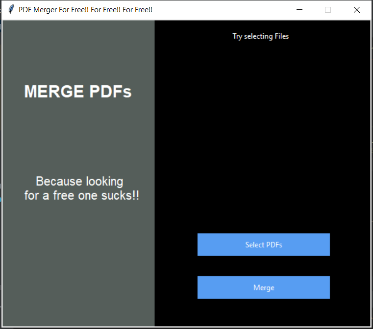

# PDFMerger

     
<h2>Motivation</h2>
o	  I was frustated with looking for free pdf mergers online, so I made my own. 
 
o	  This version can merge any number of pdfs together
 
o	  I am gonna be updating this with more features, from being able to merge specific pages to even a pdf viewer down the line and password encryption as well
 
<h2>Setup and Running</h2>
o	  Run "python main.py" from terminal when you are in the cloned/downloaded folder
 
o	  I am gonna provide exe to be able to directly install it and run (In progess)
